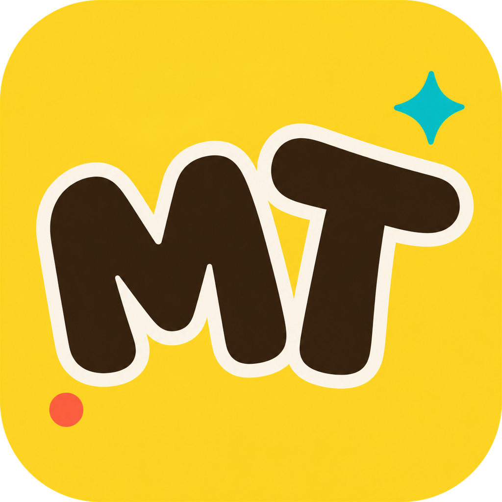

<p align="center">
  <a target="_blank" href="https://maxmelichov.github.io/MamboRambo-site/">
    
  </a>
</p>

<h1 align="center">MamboTTS</h1>

<p align="center">
  <strong>Native offline BlueTTS for desktop</strong>
</p>

<p align="center">
  <a target="_blank" href="https://maxmelichov.github.io/MamboRambo-site/">
    🔗 Download MamboTTS
  </a>
  &nbsp; | &nbsp; Give it a Star ⭐ | &nbsp;
  <a target="_blank" href="https://github.com/sponsors/maxmelichov">Support the project 🤝</a>
</p>

<hr />

<p align="center">
  <a target="_blank" href="https://maxmelichov.github.io/MamboRambo-site/">
    
  </a>
</p>

## Features

- Local text-to-speech with BlueTTS
- Fully offline generation after the model is downloaded
- Saved voices: Noa, Lily, Daniel, and Adam
- Supported languages: Hebrew, English, Spanish, German, and Italian
- Audio preview after creation
- 💻 Desktop builds for `macOS` on Apple Silicon and `Linux` on x86_64, plus a local server build for `Windows` on x86_64
- Local HTTP API with Swagger docs for tools and automation
- Agent-ready `/skill` instructions for AI workflows

## Install

One command per platform. Each script is plain text at the URL it is fetched
from, so you can read it first if you would rather see what it does before it
does it.

**macOS on Apple Silicon**

```sh
curl -fsSL https://github.com/maxmelichov/MamboTTS/releases/latest/download/install.sh | sh
```

This downloads the DMG, copies `MamboTTS.app` into `/Applications`, and then
removes the quarantine attribute with `xattr -dr com.apple.quarantine`. That
last step is the reason the script exists. The macOS build is ad-hoc signed
rather than Developer ID signed, because Developer ID signing needs a paid
Apple Developer account, so Gatekeeper refuses the first launch and tells you
nothing useful about why. Clearing the quarantine flag is the same approval as
right-clicking the app and choosing Open, granted once, out in the open, to an
app you asked for by name.

**Linux on x86_64**

```sh
curl -fsSL https://github.com/maxmelichov/MamboTTS/releases/latest/download/install.sh | sh
```

This puts the AppImage in `~/.local/bin` and writes a launcher entry into
`~/.local/share/applications`, so MamboTTS appears in your applications menu.
Nothing here asks for sudo. If your distribution has dropped `libfuse2` the
AppImage will complain, and running it with `--appimage-extract-and-run` gets
around that without installing anything.

Debian, Ubuntu, Fedora, and RHEL users who would rather use their package
manager can take the `.deb` or `.rpm` from the
[release](https://github.com/maxmelichov/MamboTTS/releases/latest) instead.

**Windows on x86_64**

```powershell
irm https://github.com/maxmelichov/MamboTTS/releases/latest/download/install.ps1 | iex
```

Windows gets the local server and its HTTP API rather than the desktop app.
There is no MamboTTS window on Windows and this script does not pretend to
install one. Producing a Windows installer needs WiX and NSIS running on a
Windows machine, and this project is built on a Mac. What does cross-compile
cleanly is the server, which is the part that actually holds the BlueTTS
runtime, so that is what ships.

The script unpacks the server into `%LOCALAPPDATA%\MamboTTS`, downloads the
BlueTTS model and the Renikud phonemizer beside it, and writes a
`MamboTTS-Server.cmd` launcher that starts the server and opens the Swagger
page. From there `/docs` is a working console over `/v1/audio/speech`,
`/v1/voices`, `/v1/phonemize`, and `/skill`, which is everything the desktop app
uses to make audio.

`install.ps1` has not been executed. There is no Windows machine here and no
`pwsh` on the build host, so it has been parsed and analyzed rather than run.
The server binary and the DLLs inside the zip are verified PE32+ artifacts. If
it fails on your machine, please open an issue with the output.

## Models and phonemizers

MamboTTS builds on these open-source projects:

- [BlueTTS](https://github.com/maxmelichov/BlueTTS) is the local ONNX text-to-speech runtime, shipped by default
- [RenikudPlus](https://github.com/maxmelichov/RenikudPlus) handles Hebrew grapheme-to-IPA conversion with speaker conditioning
- [Phonikud](https://github.com/phonikud/phonikud) supplies Hebrew vocalization and diacritics-aware IPA tools

## Python

`crates/mambotts-py` exposes the same engine to Python and ships a FastAPI
server over it, so the HTTP API is available on platforms the desktop app
does not ship an installer for. See its [README](crates/mambotts-py/README.md).

## Build

See [BUILDING.md](docs/BUILDING.md).

## Adding models

Want to ship another open-source TTS model or voice bundle with MamboTTS? See [docs/ADDING_MODELS.md](docs/ADDING_MODELS.md) for licensing, registry wiring, server/desktop steps, and the PR checklist.

---

The is code taken from [Chirp](https://github.com/thewh1teagle/chirp).
